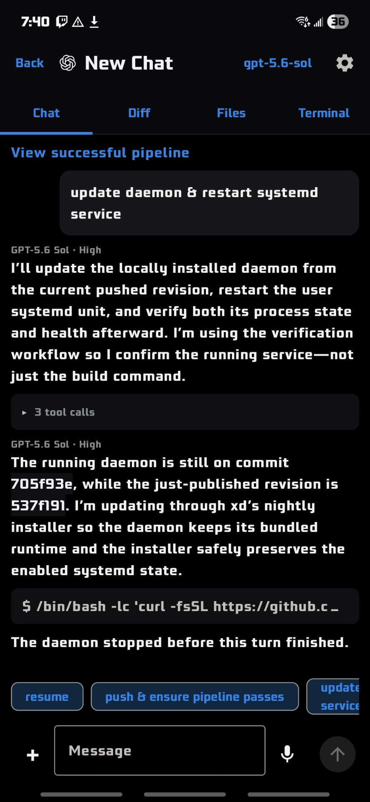
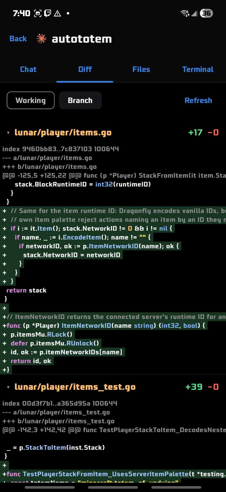
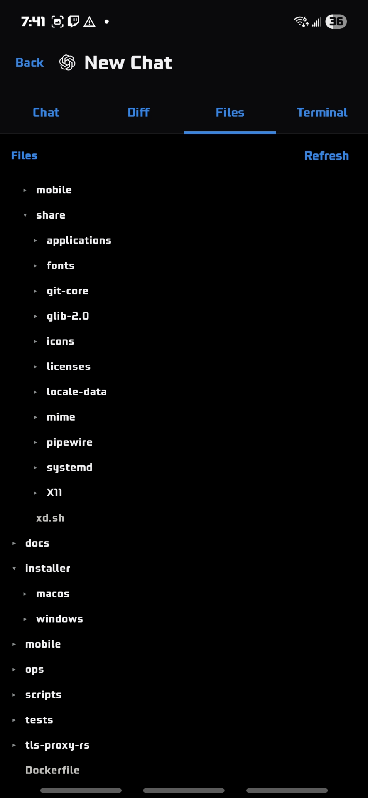
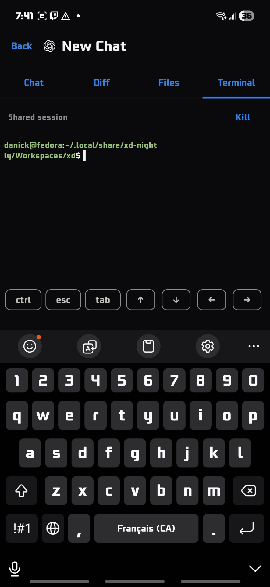

# xd

xd is a Rust/GPUI desktop client for workspace-organized Codex, Claude Code,
and JCode conversations. Chats inherit their folder's working directory,
repository, backend, model, and project instructions.


<table>
  <tr>
    <td></td>
    <td></td>
  </tr>
  <tr>
    <td></td>
    <td></td>
  </tr>
</table>

## Install

Stable and nightly install side by side with separate application identities,
settings, chats, and workspaces.

### Stable

Linux x86_64:

```sh
curl -fsSL https://github.com/RestartFU/xd/releases/latest/download/install.sh | sh -s -- --release
```

macOS (Apple Silicon or Intel):

```sh
curl -fsSL https://github.com/RestartFU/xd/releases/latest/download/install-macos.sh | sh -s -- --release
```

### Nightly

Linux x86_64:

```sh
curl -fsSL https://github.com/RestartFU/xd/releases/download/nightly/install.sh | sh
```

macOS (Apple Silicon or Intel):

```sh
curl -fsSL https://github.com/RestartFU/xd/releases/download/nightly/install-macos.sh | sh
```

The Linux and macOS installers require no root access. The bundles include the
GPUI desktop, stdio host, and their native runtime helpers.
Install the assistants you use separately and make their `codex`, `claude`, or
`jcode` commands available on `PATH`.

Stable data lives in `~/.local/share/xd` on Linux and
`~/Library/Application Support/xd` on macOS. Nightly uses the corresponding
`xd-nightly` directories. Uninstalling either app does not delete its chats or
workspaces.

## What it does

- Organizes chats in real workspace folders that can be nested, moved, or
  renamed without losing their conversations.
- Inherits folder settings and instructions down the workspace tree.
- Runs user-installed Codex, Claude Code, and JCode CLIs with their normal
  authentication and configuration.
- Supports existing checkouts and isolated Git worktrees.
- Streams Markdown responses, tool calls, inline file diffs, and images, with
  optional spoken responses.
- Supports either local use or a remote machine over the SSH command you
  configure. Remote hosts do not listen for xd connections.
- Searches all stored messages with `Ctrl+K`.

## Build and test

Linux builds require Docker only and do not install dependencies on the host:

```sh
./scripts/build.sh     # self-contained bundle in ./dist
./scripts/test.sh      # complete headless test suite
./dist/xd.sh           # run the built app
make mobile-test       # shared Kotlin tests
make mobile-android    # -> ./dist/mobile/xd-mobile-debug.apk
```

Build scripts use at most 75% of the runner's logical CPUs by default. Set
`XD_BUILD_JOBS` to a smaller positive number for a stricter local limit.

Native macOS builds require Rust, `librsvg` from Homebrew, and Apple command
line tools:

```sh
PROFILE=nightly ./scripts/build-macos.sh
# -> ./dist/macos/xd-nightly-macos-{arm64,x86_64}.zip
```

Mobile builds use their own Docker image and also require nothing beyond
Docker. See [mobile development](docs/mobile.md).

The Linux desktop lives in `desktop/`; its short-lived stdio state host lives
in `host/`. The host exits with the desktop and is not a background daemon.
