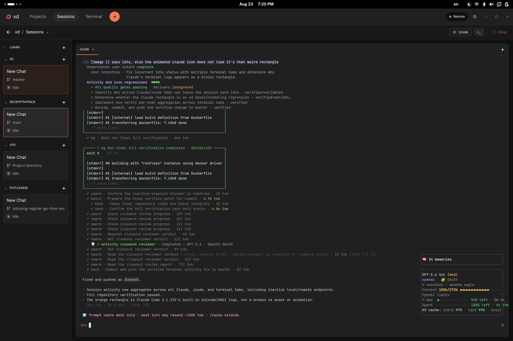
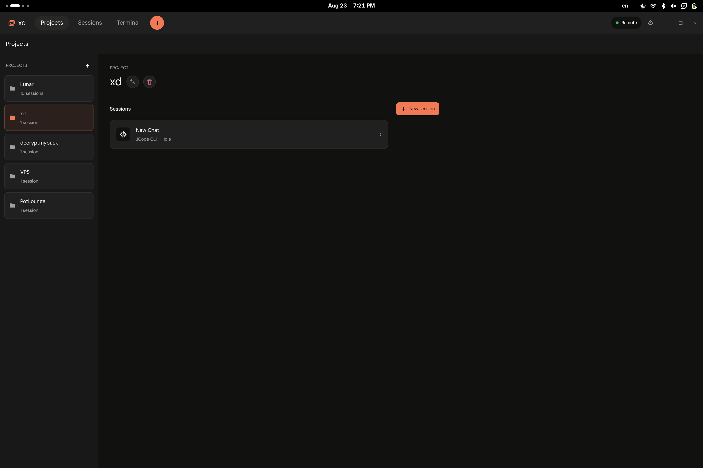
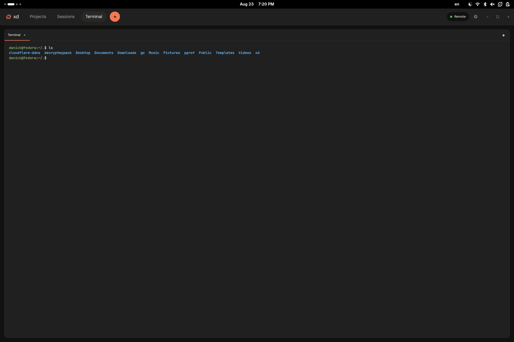
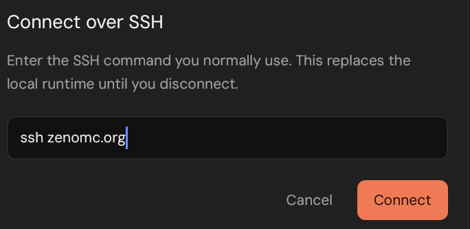

# xd

A local-first desktop workspace for user-installed Codex, Claude Code, JCode, and GitHub Copilot CLI.



<table>
  <tr>
    <td></td>
    <td></td>
  </tr>
</table>

<p align="center">
  
</p>

## Highlights

- Persistent agent and shell sessions backed by tmux.
- Local or remote over your existing SSH command, with no listening daemon.
- Projects, Git worktrees, branches, and pull requests in one workspace.
- Uses your installed CLI tools, authentication, and configuration.

## Install

Linux x86_64:

```sh
curl -fsSL https://github.com/RestartFU/xd/releases/latest/download/install.sh | sh -s -- --release
```

macOS:

```sh
curl -fsSL https://github.com/RestartFU/xd/releases/latest/download/install-macos.sh | sh -s -- --release
```

Nightly builds and the Android APK are available from the [nightly release](https://github.com/RestartFU/xd/releases/tag/nightly).
The desktop installer needs no root access. Install the assistants you use separately and keep their commands on `PATH`.

## Build

```sh
./scripts/build.sh
./scripts/test.sh
```

See [mobile development](docs/mobile.md) and [remote usage](docs/remote.md) for details.
