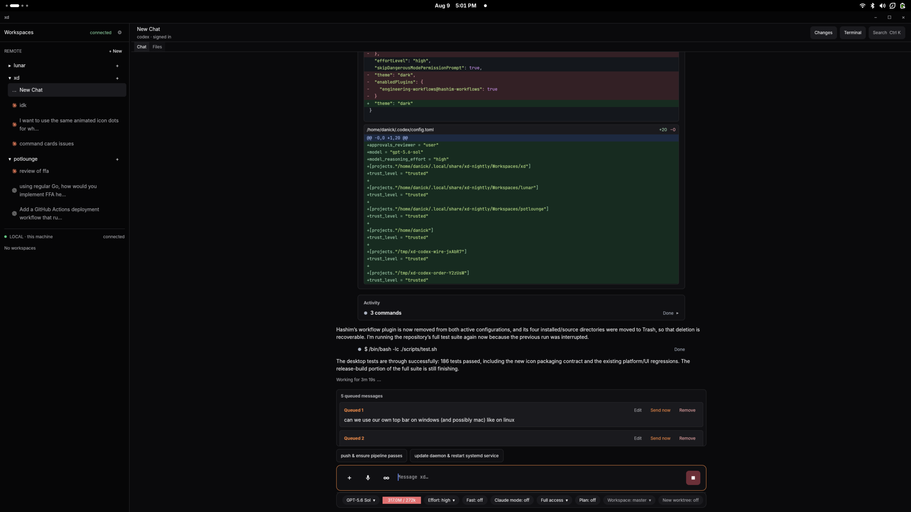

# xd

xd is a Rust/GPUI desktop client for workspace-organized Codex and Claude Code
conversations. Chats inherit their folder's working directory, repository,
backend, model, and project instructions.



## Install

Stable and nightly install side by side with separate application identities,
settings, chats, and workspaces.

### Stable

Linux x86_64:

```sh
curl -fsSL https://github.com/RestartFU/xd/releases/latest/download/install.sh | sh -s -- --release
```

macOS (Apple Silicon or Intel):

```sh
curl -fsSL https://github.com/RestartFU/xd/releases/latest/download/install-macos.sh | sh -s -- --release
```

Windows x86_64 (PowerShell):

```powershell
& ([scriptblock]::Create((irm https://github.com/RestartFU/xd/releases/latest/download/install.ps1))) -Release
```

### Nightly

Linux x86_64:

```sh
curl -fsSL https://github.com/RestartFU/xd/releases/download/nightly/install.sh | sh
```

macOS (Apple Silicon or Intel):

```sh
curl -fsSL https://github.com/RestartFU/xd/releases/download/nightly/install-macos.sh | sh
```

Windows x86_64 (PowerShell):

```powershell
irm https://github.com/RestartFU/xd/releases/download/nightly/install.ps1 | iex
```

The Linux and macOS installers require no root access; Windows uses the normal
Windows Installer elevation prompt. The bundles include the GPUI desktop, Rust
daemon, Codex, Claude Code, local Whisper speech input, and their native
runtime helpers.

Stable data lives in `~/.local/share/xd` on Linux and
`~/Library/Application Support/xd` on macOS, and `%LOCALAPPDATA%\xd` on
Windows. Nightly uses the corresponding `xd-nightly` directories. Uninstalling
either app does not delete its chats or workspaces.

## What it does

- Organizes chats in real workspace folders that can be nested, moved, or
  renamed without losing their conversations.
- Inherits folder settings and instructions down the workspace tree.
- Runs bundled Codex and Claude Code CLIs with their normal authentication and
  configuration.
- Supports existing checkouts and isolated Git worktrees.
- Streams Markdown responses, tool calls, inline file diffs, images, and voice
  messages.
- Supports local use and paired clients over the same daemon protocol,
  including an Android client that pairs with a running `xd serve`.
- Searches all stored messages with `Ctrl+K`.

## Build and test

Linux builds require Docker only and do not install dependencies on the host:

```sh
./scripts/build.sh     # self-contained bundle in ./dist
./scripts/test.sh      # complete headless test suite
./dist/xd.sh           # run the built app
make mobile-test       # shared Kotlin tests
make mobile-android    # -> ./dist/mobile/xd-mobile-debug.apk
```

Native macOS builds require Rust, `librsvg` from Homebrew, and Apple command
line tools:

```sh
PROFILE=nightly ./scripts/build-macos.sh
# -> ./dist/macos/xd-nightly-macos-{arm64,x86_64}.zip
```

Native Windows builds require Rust, CMake, 7-Zip, the Windows SDK, and .NET:

```powershell
./scripts/build-windows.ps1 -OutputDirectory windows-dist -Profile nightly
./scripts/package-windows.ps1 -Payload windows-dist -OutputDirectory artifacts -Profile nightly
# -> ./artifacts/xd-nightly-windows-x86_64.msi
```

Mobile builds use their own Docker image and also require nothing beyond
Docker. See [mobile development](docs/mobile.md).

The Linux desktop lives in `desktop/`, the daemon in `daemon-rs/`, and the
private remote TLS helper in `tls-proxy-rs/`.
