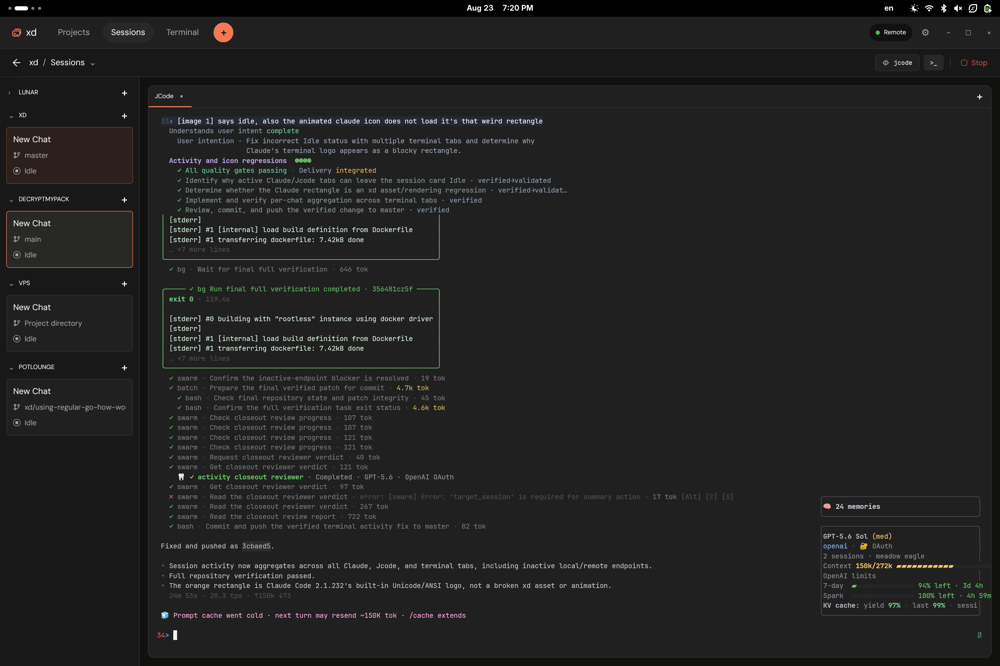
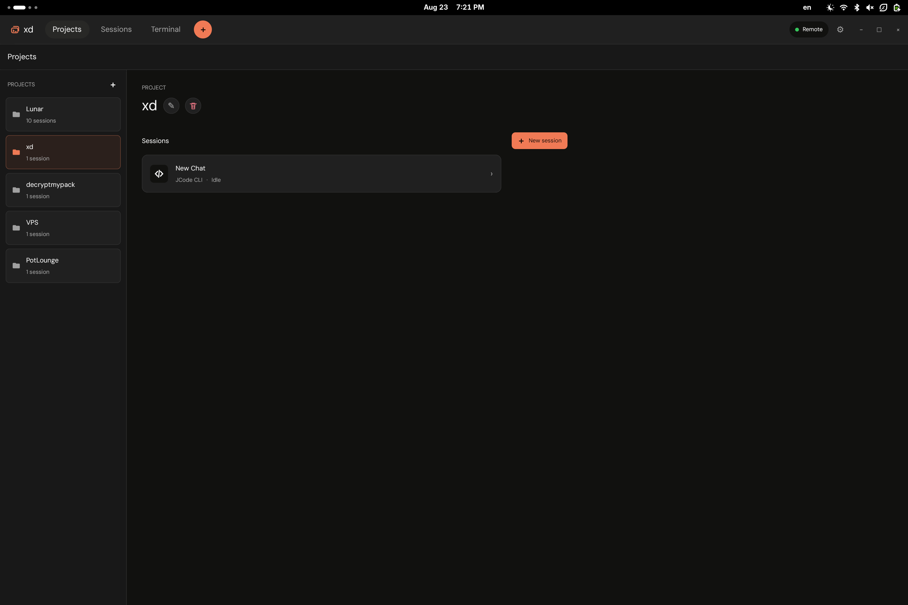
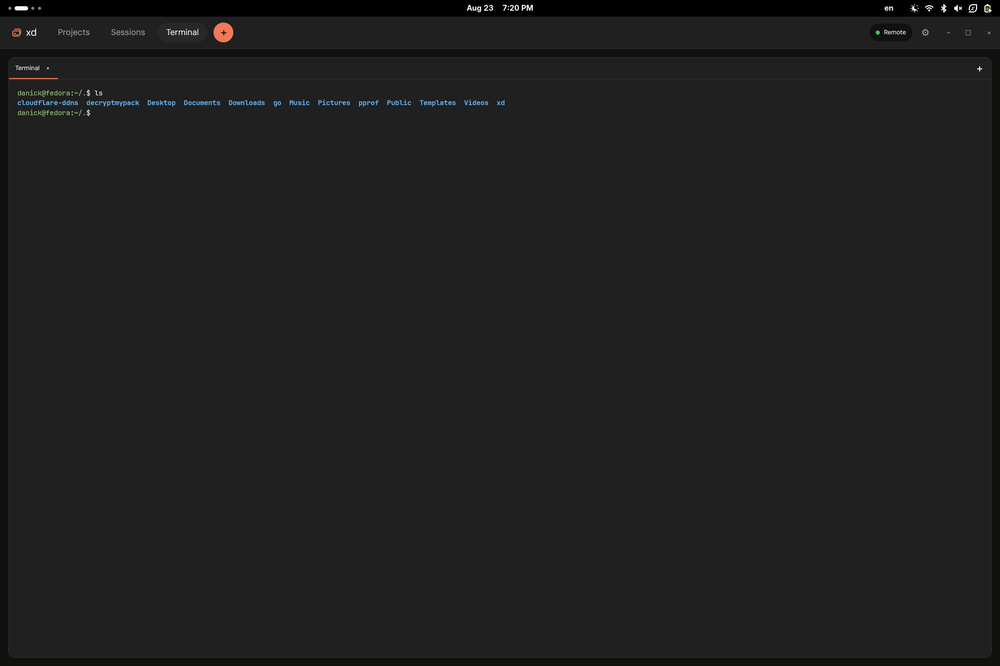
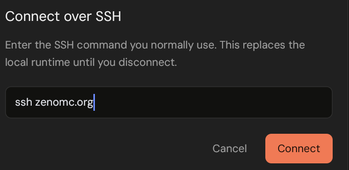

# xd

A local-first desktop workspace for user-installed Codex, Claude Code, JCode, and GitHub Copilot CLI.



<table>
  <tr>
    <td></td>
    <td></td>
  </tr>
</table>

<p align="center">
  
</p>

## Highlights

- Persistent agent and shell sessions backed by tmux.
- Local or remote over your existing SSH command, with no listening daemon.
- Projects, Git worktrees, branches, and pull requests in one workspace.
- Uses your installed CLI tools, authentication, and configuration.

## Install

Linux x86_64:

```sh
curl -fsSL https://github.com/RestartFU/xd/releases/latest/download/install.sh | sh -s -- --release
```

macOS:

```sh
curl -fsSL https://github.com/RestartFU/xd/releases/latest/download/install-macos.sh | sh -s -- --release
```

Windows x86_64: download `xd-windows-x86_64.zip` from the
[latest release](https://github.com/RestartFU/xd/releases/latest), extract the
whole archive, and run `xd.exe`. The desktop and browser run natively;
local projects and persistent sessions run in your default WSL distribution.
Install git, tmux, OpenSSH client, CA certificates, and your assistant CLIs
inside WSL first. The included README has setup instructions and a WebView2
Runtime installer helper. Set `XD_WSL_DISTRIBUTION` to select another distro.

Nightly desktop builds and the Android APK are available from the [nightly release](https://github.com/RestartFU/xd/releases/tag/nightly).
The Linux and macOS installers need no root access. Install the assistants you use separately and keep their commands on `PATH`.

## Build

```sh
./scripts/build.sh
./scripts/test.sh
```

See [mobile development](docs/mobile.md) and [remote usage](docs/remote.md) for details.

Windows builds use `scripts/build-windows.ps1` with a matching static Linux host
from `scripts/build-windows-host.sh`. The `windows` GitHub Actions workflow
builds and checks both parts, including a real Windows-to-WSL connection.
